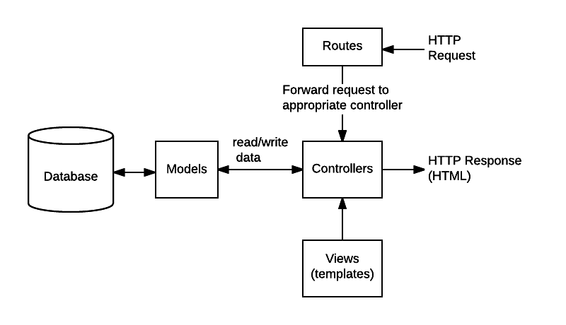

# CIAWorldFactsViewer Workshop

Welcome to the CIAWorldFactsViewer Workshop! This workshop will guide you through creating a Node.js application using Express and EJS to display CIA country profiles from the World Factbook.

## Prerequisites

Before we begin, please ensure you have the following installed on your system:

- Node.js (Download and install from [Node.js website](https://nodejs.org/))

## Learning Goals

By participating in this workshop, you will:

- Understand the basics of server-side web development with Node.js and Express.
- Learn to use EJS for dynamic content rendering on the server side.
- Gain experience in setting up a structured web application project.
- Explore handling web routes with Express.
- Start serving static files such as CSS and images to enhance the appearance of your web application.
- Get familiar with the development workflow, including initializing a project with npm and running a server.
- Discover how to deploy a Node.js application to a cloud service (optional advanced step).

## Getting Started

Follow these steps to set up and run your project.

### Step 1: Create the Project Directory

Open your terminal or command prompt and run:

```bash
mkdir CIAWorldFactsViewer
cd CIAWorldFactsViewer
```

### 2. Initialize a Node.js Project

Initialize your Node.js project with npm:

```bash
npm init -y
```

This command creates a package.json file with default settings.

### 3. Install Express and EJS

Install Express and EJS in your project:

```bash
npm install express ejs
```

# Understanding `npm install`

The `npm install` command is your gateway to utilizing external modules (libraries of code) in your Node.js project. When you execute this command followed by a package name, npm searches for the package in the npm registry—a vast online database of open-source packages. It then downloads the latest version of the package (along with its dependencies, if any) to your project.

For example, running `npm install express` will install the Express library, a minimal and flexible Node.js web application framework, making it available for your project to use.

## What Happens Behind the Scenes

When you use `npm install`:

- **Node Modules Folder:** If your project doesn't already have a `node_modules` folder, npm will create one. This folder is where npm stores all the packages (and their dependencies) that you download. Each package is placed in its own subdirectory within `node_modules`, organized to make it easy for Node.js to locate and load them when running your application.

- **package.json and package-lock.json Files:** The `package.json` file is the heart of your Node.js project. It keeps track of the project's details, such as its name, version, and most importantly, its dependencies. When you install a package, npm adds a reference to that package and its version to the `package.json` file under the `dependencies` or `devDependencies` section, depending on the nature of the package. Meanwhile, `package-lock.json` is automatically generated and keeps track of the exact version of each installed package (and the version of its dependencies), ensuring consistency across installations.

## Additional npm Commands for Beginners

- **`npm init`:** This command sets up a new Node.js project. It prompts you to enter several project details (like name, version, and description) and generates a `package.json` file based on your input.

- **`npm install` (without any package name):** When run in this manner, npm looks at the `package.json` file and installs all the dependencies listed there. This is particularly useful when you clone an existing project and need to install all its dependencies.

- **`npm update`:** This command checks your installed packages for any updates. If newer versions are available, it will update your `node_modules` to the latest versions, according to the version ranges specified in your `package.json`.

- **`npm uninstall <package-name>`:** Removes a package from your `node_modules` folder and its reference from the `package.json` file.

## Tips for Managing npm Packages

- Regularly run `npm update` to keep your dependencies up to date with the latest versions. This can help you benefit from the latest features, performance improvements, and security patches.

- Before adding a new package to your project, check its documentation and the number of weekly downloads on the npm website to ensure it's widely used and maintained.

- Be cautious with major version updates of packages, as they may include breaking changes. Always test your application thoroughly after updating dependencies.

Understanding these fundamentals of npm will not only help you set up your Node.js projects more effectively but also give you a solid foundation for managing project dependencies as you dive deeper into Node.js development.

### 4. Set Up Your Project Structure

This the project structure we will be going for. Lets get started!

```
CIAWorldFactsViewer/
├─ node_modules/
├─ views/
│ ├─ index.ejs
├─ public/
│ ├─ css/
│ ├─ js/
│ ├─ images/
├─ app.js
├─ package.json
```
Lets add the following line to the package.json to use ESM
```bash
  "type": "module",
```
Use the following commands to create the directories and initial files:

```bash
mkdir views
mkdir public
touch app.js
```

### 5. Setting up the server

Open app.js in your text editor and start by requiring the Express module. This step makes the Express library available to your application:

```javascript
import  express from "express";
const app = express();
```

Next, we'll tell Express to use EJS as its templating engine. This allows us to use EJS syntax for dynamic content in our views:

```javascript
app.set("view engine", "ejs");
```

Serve Static Files
It's common for web applications to serve static files such as images, CSS, and JavaScript. Let's configure Express to serve these files from the public directory:

```javascript
app.use(express.static("public"));
```

Create a Route
Now, let's create a basic route that renders our index.ejs view when users visit the home page (/). Add the following route to your app.js:

```javascript
app.get("/", (req, res) => {
  res.render("index");
});
```

## 6: Start the Server

Finally, let's add the code to start the Express server on a specified port. The common development port for Node.js applications is 3000, but you can choose any port that's available. We will also log a clickable URL to the console for easy access:

```javascript
const PORT = process.env.PORT || 3000;
app.listen(PORT, () => {
  console.log(
    `Server is running on port ${PORT}. Open http://localhost:${PORT} in your browser.`
  );
});
```

#### Creating the index.ejs View

Before we proceed, it's essential to ensure that our project has an `index.ejs` file located in the `views` directory. This file will serve as the homepage of our application and demonstrate dynamic content rendering using EJS.

Let's go ahead and create this file with some initial HTML content. Navigate to your project's `/views` directory and create a new file named `index.ejs`, then paste the following HTML code into it:

```html
<!DOCTYPE html>
<html lang="en">
  <head>
    <meta charset="UTF-8" />
    <title>CIAWorldFactsViewer</title>
  </head>
  <body>
    <h1>Welcome to the CIAWorldFactsViewer </h1>
    <p>This is a prototype of the CIAWorldFactsViewer application.</p>
  </body>
</html>
```

Step 7: Run Your Application
With your app.js file set up, you're ready to start the server and see your application in action. Run the following command in your terminal:

```bash
node app.js
```

Open a web browser and navigate to http://localhost:3000 to view your application.

### 7. Install Tailwind CSS

To use Tailwind CSS in your project, you'll first need to install it along with its peer dependencies and set it up. Run the following commands in your terminal:

```bash
npm install tailwindcss
npx tailwindcss init
```

This will create a tailwind.config.js file in your project directory, where you can customize Tailwind's configuration.
lets update that file to use our ejs extensions.

```javascript
// tailwind.config.js

/** @type {import('tailwindcss').Config} */
module.exports = {
  content: ["./views/**/*.ejs"],
  theme: {
    extend: {},
  },
  plugins: [],
};
```

### Configure Tailwind to Process Your CSS

Create a CSS file in your `public/css` directory named `styles.css`. Add the following Tailwind directives to it:

```css
@tailwind base;
@tailwind components;
@tailwind utilities;
```

Generate your Tailwind CSS file: Run the following command in your terminal to compile your CSS, including Tailwind's styles, into a final stylesheet:

```bash
 npx tailwindcss  -i public/css/styles.css -o public/css/output.css
```

This command reads your `styles.css` with Tailwind directives and outputs a fully compiled CSS file (`output.css`) that includes all of Tailwind's utility classes.

Include the Compiled CSS in Your Views: Ensure your `views/index.ejs` include a link to the compiled CSS file.
lets also add some tailwind styles to our `index.ejs`

```html
<!DOCTYPE html>
<html lang="en">
  <head>
    <meta charset="UTF-8" />
    <meta name="viewport" content="width=device-width, initial-scale=1.0" />
    <title>CIAWorldFactsViewer</title>
    <link type="text/css" rel="stylesheet" href="/css/output.css" />
  </head>
  <body class="bg-gray-100 flex justify-center items-center h-screen">
    <div class="text-center">
      <h1 class="text-4xl font-bold mb-4">
        Welcome to the CIAWorldFactsViewer
      </h1>
      <p class="text-lg">
        This is a prototype of the CIAWorldFactsViewer application.
      </p>
    </div>
  </body>
</html>
```

### 8. Lets build the route that will take our country

A common architectural pattern is to separate the routing logic from the business logic. This separation allows for better organization of code, easier maintenance, and scalability of the application.

#### Routes

Routes in an Express application define the endpoints (URL paths) and HTTP methods (GET, POST, PUT, DELETE, etc.) that clients can access.

Each route typically corresponds to a specific functionality or resource within the application.

**_Route Definitions:_** Route definitions are usually located in separate files within a routes directory. These files define the route paths and associated controller methods.

**_Express Router:_** Express provides a built-in Router middleware, which allows you to group related routes together. You can create a router instance in each route file to define routes specific to that file.

#### Controllers

Controllers contain the actual business logic of your application. They handle incoming requests from routes, process the data as necessary, and generate appropriate responses, often rendering views using EJS templates.

***Controller Methods:*** Each controller method corresponds to a specific route handler. These methods typically perform tasks such as fetching data from a database, processing user input, or performing business logic operations.

***Separation of Concerns:*** Controllers focus solely on handling the logic of the application without being concerned with the routing or presentation aspects. This separation of concerns promotes code reusability and maintainability.

Example Structure:
 ```arduino
project/
├─ routes/
│ ├─ index.js // Main routes file
│ └─ users.js // Routes for user-related functionality
├─ controllers/
│ ├─ indexController.js // Controller for main routes
│ └─ userController.js // Controller for user-related functionality
├─ views/
│ ├─ index.ejs // EJS template for main routes
│ └─ user.ejs // EJS template for user-related views
├─ app.js // Entry point of the application
└─ ...
```
#### Benefits:
***Modularity:*** Separating routes and controllers into different files allows for better organization and easier navigation of code.

***Testability:*** Controllers can be easily unit-tested without the need for HTTP requests, improving the testability of the application.

***Scalability: *** As the application grows, adding new routes and controllers becomes more manageable and less prone to conflicts.

***Code Reusability:*** Controllers can be reused across multiple routes or even in different applications, enhancing code reusability.

In summary, adopting a routes -> controllers structure in a Node.js application with EJS templates promotes maintainability, testability, and scalability, while also improving code organization and reusability.

To build a route that takes in two query parameters for country code, we first need to install got for fetching data from the CIA World Factbook API.

```bash
npm install got
```

First, let's establish a controller for retrieving country data and define a new route in `app.js`:
### Creating the Route
Create a new directory named ```routes``` 
```bash
mkdir routes
```
Inside there lets make a file named countryRoutes.js

```bash
cd routes
touch countryRoutes.js
```

Define the Route: Now, let's create the route responsible for handling requests related to countries.
```javascript
import express from "express";
const router = express.Router();

// Define the country route with parameters for the region and country
router.get("/:region/:country", (req, res) => {
    // Retrieve the region and country parameters from the request object
    const { region, country } = req.params;
    
    // Example response for demonstration
    res.send(`Region: ${region}, Country: ${country}`);
});

export default router;

```
Integrate the Route: Next, integrate the newly created route into the `app.js` file.
```javascript
const express = require("express");
const app = express();
import countryRoutes from "./routes/countryRoutes.js"

app.use(express.static("public"));

app.set("view engine", "ejs");

app.get("/", (req, res) => {
  res.render("index");
});

app.use("/cia-profile", countryRoutes);

const PORT = process.env.PORT || 3000;
app.listen(PORT, () => {
  console.log(`Server is running on port ${PORT}. Open http://localhost:${PORT} in your browser.`);
});
```

# Fetching Data with Got in Our Node.js Application

In this section of the  Workshop, we'll be enhancing our application by integrating real-time data fetching capabilities. We've chosen `got` as our HTTP client for making requests to external APIs. Previously, in our React workshop, we explored `axios`, another popular choice for HTTP requests. This time, let's delve into `got` and its benefits, as well as touch upon other client libraries you might consider.
`Got` is a human-friendly and powerful HTTP request library for Node.js. It simplifies the process of making HTTP requests and handles a wide array of HTTP-related tasks seamlessly.

### Why Choose Got?
***Immutability:*** Each request is encapsulated, avoiding side effects and making it easier to reason about your code.
***Promises & Async/Await:*** Got supports modern JavaScript features, including Promises and async/await, facilitating more readable and maintainable code.
***Retry Mechanisms:*** It comes with built-in retry mechanisms, reducing the boilerplate code you need to write for retrying failed requests.
***Streaming:*** Got supports efficient streaming of requests and responses, which is particularly useful for handling large datasets or files.
***Error Handling:*** Enhanced error handling provides more context in case of request failures, improving debuggability.

### Other HTTP Client Libraries
While `got` offers a robust set of features for server-side applications, several other libraries are available, each with its unique strengths:

***Fetch API:*** A native browser API for making HTTP requests. Node.js does not support it out of the box, but polyfills like node-fetch are available.
***SuperAgent:*** An HTTP request library that features a fluent API. It's designed to be lightweight and flexible.
***Request:*** Though deprecated, Request was once the go-to HTTP client for Node.js. It's simple to use but no longer maintained.

Choosing the right HTTP client depends on your project's specific needs, the features you require, and the development environment. For server side I thought it would be nice if we look at another library just to get familiar. 

Lets add this file at the root of our project named `worldfacts.js`

Ive only added some of athe countries, feel free to add the rest.

```javascript
export const countries = {
  "central-america-n-caribbean": {
    "aruba": {
      "url": "https://raw.githubusercontent.com/factbook/factbook.json/master/central-america-n-caribbean/aa.json"
    },
    "anguilla": {
      "url": "https://raw.githubusercontent.com/factbook/factbook.json/master/central-america-n-caribbean/av.json"
    },
    "curacao": {
      "url": "https://raw.githubusercontent.com/factbook/factbook.json/master/central-america-n-caribbean/uc.json"
    },
    "sint maarten": {
      "url": "https://raw.githubusercontent.com/factbook/factbook.json/master/central-america-n-caribbean/nn.json"
    },
    "trinidad and tobago": {
      "url": "https://raw.githubusercontent.com/factbook/factbook.json/master/central-america-n-caribbean/td.json"
    },
    "saint barthelemy": {
      "url": "https://raw.githubusercontent.com/factbook/factbook.json/master/central-america-n-caribbean/tb.json"
    },
    "saint martin": {
      "url": "https://raw.githubusercontent.com/factbook/factbook.json/master/central-america-n-caribbean/rn.json"
    },
    "british virgin islands": {
      "url": "https://raw.githubusercontent.com/factbook/factbook.json/master/central-america-n-caribbean/vi.json"
    },
    "cayman islands": {
      "url": "https://raw.githubusercontent.com/factbook/factbook.json/master/central-america-n-caribbean/cj.json"
    },
    "montserrat": {
      "url": "https://raw.githubusercontent.com/factbook/factbook.json/master/central-america-n-caribbean/mh.json"
    },
    "turks and caicos islands": {
      "url": "https://raw.githubusercontent.com/factbook/factbook.json/master/central-america-n-caribbean/tk.json"
    },
    "virgin islands": {
      "url": "https://raw.githubusercontent.com/factbook/factbook.json/master/central-america-n-caribbean/vq.json"
    },
    "puerto rico": {
      "url": "https://raw.githubusercontent.com/factbook/factbook.json/master/central-america-n-caribbean/rq.json"
    },
    "navassa island": {
      "url": "https://raw.githubusercontent.com/factbook/factbook.json/master/central-america-n-caribbean/bq.json"
    }
  },
  "australia-oceania": {
    "australia": {
      "url": "https://raw.githubusercontent.com/factbook/factbook.json/master/australia-oceania/as.json"
    },
    "fiji": {
      "url": "https://raw.githubusercontent.com/factbook/factbook.json/master/australia-oceania/fj.json"
    },
    "kiribati": {
      "url": "https://raw.githubusercontent.com/factbook/factbook.json/master/australia-oceania/kr.json"
    },
    "marshall islands": {
      "url": "https://raw.githubusercontent.com/factbook/factbook.json/master/australia-oceania/rm.json"
    },
    "micronesia": {
      "url": "https://raw.githubusercontent.com/factbook/factbook.json/master/australia-oceania/fm.json"
    },
    "nauru": {
      "url": "https://raw.githubusercontent.com/factbook/factbook.json/master/australia-oceania/nr.json"
    },
    "new zealand": {
      "url": "https://raw.githubusercontent.com/factbook/factbook.json/master/australia-oceania/nz.json"
    },
    "palau": {
      "url": "https://raw.githubusercontent.com/factbook/factbook.json/master/australia-oceania/ps.json"
    },
    "papua new guinea": {
      "url": "https://raw.githubusercontent.com/factbook/factbook.json/master/australia-oceania/pp.json"
    },
    "samoa": {
      "url": "https://raw.githubusercontent.com/factbook/factbook.json/master/australia-oceania/ws.json"
    },
    "solomon islands": {
      "url": "https://raw.githubusercontent.com/factbook/factbook.json/master/australia-oceania/bp.json"
    },
    "tonga": {
      "url": "https://raw.githubusercontent.com/factbook/factbook.json/master/australia-oceania/tn.json"
    },
    "tuvalu": {
      "url": "https://raw.githubusercontent.com/factbook/factbook.json/master/australia-oceania/tv.json"
    },
    "vanuatu": {
      "url": "https://raw.githubusercontent.com/factbook/factbook.json/master/australia-oceania/nh.json"
    },
    "cook islands": {
      "url": "https://raw.githubusercontent.com/factbook/factbook.json/master/australia-oceania/cw.json"
    },
    "niue": {
      "url": "https://raw.githubusercontent.com/factbook/factbook.json/master/australia-oceania/ne.json"
    },
    "tokelau": {
      "url": "https://raw.githubusercontent.com/factbook/factbook.json/master/australia-oceania/tl.json"
    },
    "french polynesia": {
      "url": "https://raw.githubusercontent.com/factbook/factbook.json/master/australia-oceania/fp.json"
    },
    "new caledonia": {
      "url": "https://raw.githubusercontent.com/factbook/factbook.json/master/australia-oceania/nc.json"
    },
    "wallis and futuna": {
      "url": "https://raw.githubusercontent.com/factbook/factbook.json/master/australia-oceania/wf.json"
    },
    "american samoa": {
      "url": "https://raw.githubusercontent.com/factbook/factbook.json/master/australia-oceania/aq.json"
    }
  },
  "south-asia": {
    "afghanistan": {
      "url": "https://raw.githubusercontent.com/factbook/factbook.json/master/south-asia/af.json"
    },
    "bangladesh": {
      "url": "https://raw.githubusercontent.com/factbook/factbook.json/master/south-asia/bg.json"
    },
    "bhutan": {
      "url": "https://raw.githubusercontent.com/factbook/factbook.json/master/south-asia/bt.json"
    },
    "india": {
      "url": "https://raw.githubusercontent.com/factbook/factbook.json/master/south-asia/in.json"
    },
    "maldives": {
      "url": "https://raw.githubusercontent.com/factbook/factbook.json/master/south-asia/mv.json"
    },
    "nepal": {
      "url": "https://raw.githubusercontent.com/factbook/factbook.json/master/south-asia/np.json"
    },
    "pakistan": {
      "url": "https://raw.githubusercontent.com/factbook/factbook.json/master/south-asia/pk.json"
    },
    "sri lanka": {
      "url": "https://raw.githubusercontent.com/factbook/factbook.json/master/south-asia/ce.json"
    }
  },
  "europe": {
    "albania": {
      "url": "https://raw.githubusercontent.com/factbook/factbook.json/master/europe/al.json"
    },
    "andorra": {
      "url": "https://raw.githubusercontent.com/factbook/factbook.json/master/europe/an.json"
    },
    "austria": {
      "url": "https://raw.githubusercontent.com/factbook/factbook.json/master/europe/au.json"
    },
    "belarus": {
      "url": "https://raw.githubusercontent.com/factbook/factbook.json/master/europe/bo.json"
    },
    "belgium": {
      "url": "https://raw.githubusercontent.com/factbook/factbook.json/master/europe/be.json"
    },
    "bosnia and herzegovina": {
      "url": "https://raw.githubusercontent.com/factbook/factbook.json/master/europe/bk.json"
    },
    "bulgaria": {
      "url": "https://raw.githubusercontent.com/factbook/factbook.json/master/europe/bu.json"
    },
    "croatia": {
      "url": "https://raw.githubusercontent.com/factbook/factbook.json/master/europe/hr.json"
    },
    "cyprus": {
      "url": "https://raw.githubusercontent.com/factbook/factbook.json/master/europe/cy.json"
    },
    "czechia": {
      "url": "https://raw.githubusercontent.com/factbook/factbook.json/master/europe/ez.json"
    },
    "denmark": {
      "url": "https://raw.githubusercontent.com/factbook/factbook.json/master/europe/da.json"
    },
    "estonia": {
      "url": "https://raw.githubusercontent.com/factbook/factbook.json/master/europe/en.json"
    },
    "finland": {
      "url": "https://raw.githubusercontent.com/factbook/factbook.json/master/europe/fi.json"
    },
    "france": {
      "url": "https://raw.githubusercontent.com/factbook/factbook.json/master/europe/fr.json"
    },
    "germany": {
      "url": "https://raw.githubusercontent.com/factbook/factbook.json/master/europe/gm.json"
    },
    "greece": {
      "url": "https://raw.githubusercontent.com/factbook/factbook.json/master/europe/gr.json"
    },
    "hungary": {
      "url": "https://raw.githubusercontent.com/factbook/factbook.json/master/europe/hu.json"
    },
    "iceland": {
      "url": "https://raw.githubusercontent.com/factbook/factbook.json/master/europe/ic.json"
    },
    "ireland": {
      "url": "https://raw.githubusercontent.com/factbook/factbook.json/master/europe/ei.json"
    },
    "italy": {
      "url": "https://raw.githubusercontent.com/factbook/factbook.json/master/europe/it.json"
    },
    "latvia": {
      "url": "https://raw.githubusercontent.com/factbook/factbook.json/master/europe/lg.json"
    },
    "liechtenstein": {
      "url": "https://raw.githubusercontent.com/factbook/factbook.json/master/europe/ls.json"
    },
    "lithuania": {
      "url": "https://raw.githubusercontent.com/factbook/factbook.json/master/europe/lh.json"
    },
    "luxembourg": {
      "url": "https://raw.githubusercontent.com/factbook/factbook.json/master/europe/lu.json"
    },
    "malta": {
      "url": "https://raw.githubusercontent.com/factbook/factbook.json/master/europe/mt.json"
    },
    "moldova": {
      "url": "https://raw.githubusercontent.com/factbook/factbook.json/master/europe/md.json"
    },
    "monaco": {
      "url": "https://raw.githubusercontent.com/factbook/factbook.json/master/europe/mn.json"
    },
    "montenegro": {
      "url": "https://raw.githubusercontent.com/factbook/factbook.json/master/europe/mj.json"
    },
    "netherlands": {
      "url": "https://raw.githubusercontent.com/factbook/factbook.json/master/europe/nl.json"
    },
    "north macedonia": {
      "url": "https://raw.githubusercontent.com/factbook/factbook.json/master/europe/mk.json"
    },
    "norway": {
      "url": "https://raw.githubusercontent.com/factbook/factbook.json/master/europe/no.json"
    },
    "poland": {
      "url": "https://raw.githubusercontent.com/factbook/factbook.json/master/europe/pl.json"
    },
    "portugal": {
      "url": "https://raw.githubusercontent.com/factbook/factbook.json/master/europe/po.json"
    },
    "romania": {
      "url": "https://raw.githubusercontent.com/factbook/factbook.json/master/europe/ro.json"
    },
    "russia": {
      "url": "https://raw.githubusercontent.com/factbook/factbook.json/master/europe/rs.json"
    },
    "san marino": {
      "url": "https://raw.githubusercontent.com/factbook/factbook.json/master/europe/sm.json"
    }
  }
}
```


In the countryRoutes.js file, we've set up the infrastructure for handling requests to fetch data for specific countries. By importing modules like `express`, `got`, and the `worldfacts.js`, we're equipped to execute requests efficiently. The route defined takes parameters for both the region and the country, constructs a URL to fetch country-specific data, and then sends this data back to the client. Should you encounter errors during this process, they're handled gracefully, providing feedback through the console and an appropriate server response.

```javascript
import  express from "express";
import got from 'got';
const router = express.Router();
import * as data from '../worldfacts.js'

// Define the country route with parameters for the region and country
router.get("/:region/:country", async (req, res) => {
    const { region, country } = req.params;
    console.log(region,country)
    
    try {
        // Construct the URL for the specific country
        const {countries} = data
        const countryUrl = countries[region][country].url;

        // Fetch country data from the provided URL
        const response = await got.get(countryUrl).json();
        const countryData = response;
        
        // Send the country data back as a response
        res.json(countryData);
    } catch (error) {
        // Handle errors
        console.error('Error fetching country data:', error);
        res.status(500).json({ error: 'Internal Server Error' });
    }
});

export default router;
```

Upon successfully integrating this route, you'll be able to retrieve country data by navigating to URLs structured as shown below in your web browser. This example URL targets the country profile for Aruba within the Central America and Caribbean region:
```bash 
http://localhost:3000/cia-profile/central-america-n-caribbean/aruba
```

Congratulations on reaching this milestone! With the backend now capable of serving detailed country data, the next step involves enhancing the user experience through a more interactive interface. Proceed by creating a new view named `cia-profile.ejs` within the views directory and adding a new route to handle that request at `/cia-profile`. 

Utilize the `worldfacts.js` file as a foundation to construct menus, enabling users to easily select and explore data across different countries and regions. This approach not only simplifies navigation but also makes the exploration of global facts a more engaging and informative experience.

heres what `countryRoutes.js`should look like

```javascript
import  express from "express";
import got from 'got';
const router = express.Router();
import * as data from '../worldfacts.js'


router.get('/', async (req, res) => {
    // Transform the countries object into an array of continents, each with its countries
    const continentsWithCountries = Object.entries(data.countries).map(([continentKey, countries]) => {
        return {
            name: continentKey,
            countries: Object.keys(countries) // Grab only the country names
        };
    });

    // Pass this structured data to the view
    res.render('cia-profile', { continentsWithCountries: continentsWithCountries });
});

// Define the country route with parameters for the region and country
router.get("/:region/:country", async (req, res) => {
    const { region, country } = req.params;
    console.log(region,country)
    
    try {
        // Construct the URL for the specific country
        const {countries} = data
        const countryUrl = countries[region][country].url;

        // Fetch country data from the provided URL
        const response = await got.get(countryUrl).json();
        const countryData = response;

        // Send the country data back as a response
        res.json(countryData);
    } catch (error) {
        // Handle errors
        console.error('Error fetching country data:', error);
        res.status(500).json({ error: 'Internal Server Error' });
    }
});

export default router;

```
### Important Concepts for Beginners
**Routing:** The way your application responds to a client request to a specific endpoint.

**Middleware**: Functions that have access to the request object (req), the response object (res), and the next middleware function in the application’s request-response cycle. Middleware can execute code, make changes to the request and response objects, end the request-response cycle, or call the next middleware function.

**Async/Await:** Used for handling asynchronous operations in a more synchronous manner, which is particularly useful when fetching data from an API.

**Error Handling:** It's crucial to handle errors gracefully in your application to prevent crashes and provide useful feedback to the user.

**Modularity:** Breaking your application into smaller, more manageable pieces (like the countryRoutes.js module) helps keep your codebase clean and more maintainable.

Now lets make the front end of the application use the code snip below for the `cia-profile.ejs` view

```ejs
<!DOCTYPE html>
<html lang="en">
<head>
    <meta charset="UTF-8">
    <meta name="viewport" content="width=device-width, initial-scale=1.0">
    <title>Select Country</title>
    <link type="text/css" rel="stylesheet" href="/css/output.css"> <!-- Ensure Tailwind CSS is correctly linked -->
</head>
<body class="bg-gray-100">
    <!-- Flex container: Column on small screens, row on larger screens -->
    <div class="min-h-screen flex flex-col md:flex-row flex-wrap justify-start p-5">
        <% continentsWithCountries.forEach((continent, index) => { %>
            <!-- Continent block: Full width on small screens, adjustable fractions on larger screens -->
            <div class="w-full md:w-1/2 lg:w-1/3 px-4 mb-10">
                <div class="p-6 shadow-xl rounded-lg bg-white border-l-4 border-blue-500">
                    <h3 class="text-2xl md:text-3xl font-bold mb-5 text-gray-800">
                        <%= continent.name.replace(/-/g, ' ').toUpperCase() %>
                    </h3>
                    <ul class="list-none pl-0">
                        <% continent.countries.forEach(country => { %>
                            <li class="mb-3">
                                <!-- Country link: Improved readability on hover -->
                                <a href="/cia-profile/<%=continent.name %>/<%= country %>" class="block p-3 rounded-md hover:bg-blue-100 text-blue-600 hover:text-blue-800 transition-colors duration-200 ease-in-out">
                                    <%= country.replace(/-/g, ' ').toUpperCase() %>
                                </a>
                            </li>
                        <% }); %>
                    </ul>
                </div>
            </div>
        <% }); %>
    </div>
</body>
</html>
```
Nice we should be able to see each country now and click around dope af.

Moving back to our `/continent:country` route we need to now render a page instead, as well as make the data look nice.

To display the country data in a more informative and visually appealing way, we'll create a new EJS view named `country-detail.ejs`. 

Setting up the View: Create a file named `country-detail.ejs` in your views directory. This file will render the details of the country selected by the user.

```ejs
<!DOCTYPE html>
<html lang="en">
<head>
    <meta charset="UTF-8">
    <meta name="viewport" content="width=device-width, initial-scale=1.0">
    <title>Country Detail</title>
    <link href="/css/output.css" rel="stylesheet">
</head>
<body class="bg-gray-100">
    <div class="container mx-auto px-4 py-8">
        <h1 class="text-4xl font-bold text-center mb-12">Country Profile</h1>
        <% function renderObject(obj, indent = 0) { %>
            <% for (const [key, value] of Object.entries(obj)) { %>
                <% if (typeof value === 'object' && value !== null && !(value instanceof Array)) { %>
                    <div style="margin-left: <%= indent %>px;">
                        <h2 class="text-xl font-semibold"><%= key.replace(/([A-Z])/g, ' $1').trim() %></h2>
                        <%= renderObject(value, indent + 20) %>
                    </div>
                <% } else { %>
                    <div style="margin-left: <%= indent %>px;" class="mb-2">
                        <strong><%= key.replace(/([A-Z])/g, ' $1').trim() %>:</strong> <%= value.text ? value.text : value %>
                    </div>
                <% } %>
            <% } %>
        <% } %>

        <% for (const section in countryData) { %>
            <div class="bg-white shadow-md rounded-lg p-6 mb-6">
                <h2 class="text-2xl font-bold mb-4"><%= section.replace(/([A-Z])/g, ' $1').trim() %></h2>
                <% renderObject(countryData[section]) %>
            </div>
        <% } %>
    </div>
</body>
</html>


```

in our countryRoutes.js file all we need to do is render this new view and add the data:

```javascript

// Define the country route with parameters for the region and country
router.get("/:region/:country", async (req, res) => {
    const { region, country } = req.params;
    console.log(region,country)
    
    try {
        // Construct the URL for the specific country
        const {countries} = data
        const countryUrl = countries[region][country].url;

        // Fetch country data from the provided URL
        const response = await got.get(countryUrl).json();
        const countryData = response;

        // Send the country data back as a response
        res.render('country-detail', { countryData: countryData });
        
    } catch (error) {
        // Handle errors
        console.error('Error fetching country data:', error);
        res.status(500).json({ error: 'Internal Server Error' });
    }
});

```
Congratulations on completing the core development of your Express app! You've built a dynamic, scalable application capable of rendering detailed country profiles from structured data. This project not only showcases your skills in handling backend logic with Express but also demonstrates your ability to dynamically generate frontend content with EJS and style it using Tailwind CSS.


### Next Steps to Enhance Your Project
**Refine the UI/UX:** Although we've applied a dynamic approach to render all data keys, consider designing specific templates for different types of data. This could involve creating custom components for visualizing geographical data, demographic statistics, or historical facts, making the user interface more engaging.

**Expand the Database:** You've laid the groundwork for a scalable application. Continue to enrich your database by adding more countries, historical data, or even real-time data if available. The more comprehensive your database, the more valuable your application becomes.

**Incorporate Interactive Elements:** Consider adding interactive maps, graphs, or charts using JavaScript libraries like D3.js or Leaflet. Interactive elements can make complex data more accessible and engaging for users.

### Deployment Suggestions
Deploying your application makes it accessible to a wider audience and allows you to gather real user feedback. Here are a few platforms that are well-suited for deploying Express applications:

**Heroku:** A popular platform that simplifies the deployment process for Express apps. It offers a free tier for small projects, making it a great starting point. Heroku also provides add-ons for databases and analytics.

**Vercel:** Known for hosting front-end projects, Vercel also supports Node.js applications. It offers easy integration with GitHub for continuous deployment and provides a smooth deployment process.

**DigitalOcean App Platform:** This platform allows you to deploy your app on cloud infrastructure with minimal configuration. DigitalOcean offers scalability, reliability, and a range of pricing options, including a pay-as-you-go model.

**AWS Elastic Beanstalk:** For those looking to scale their application and leverage AWS services, Elastic Beanstalk automates the deployment process, including provisioning, load balancing, and auto-scaling.

**Netlify:** While primarily focused on front-end projects, Netlify can serve serverless backend functions, which can be used in conjunction with your Express application for specific functionalities.

When choosing a platform, consider your project's specific needs, such as traffic expectations, budget, and whether you require additional services like databases or analytics.

### Wrapping Up
Your presence and dedication have been immensely appreciated. It's my sincere hope that this experience has not only enriched your knowledge but also ignited a spark within you to continue exploring and learning. When you feel prepared, I encourage you to share the wisdom you've acquired with the next generation of students. Together, through collaboration and creativity, we can foster a culture of growth and innovation at CSUB. With love until next time -csgod

Reference 
https://github.com/factbook/factbook.json